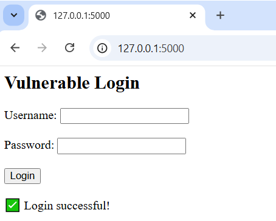

# SQL-Injection_Task_Tool
# SQL Injection Detection Tool & Vulnerable Web App

This project simulates a classic SQL Injection vulnerability using Flask and SQLite, and includes a Python script that automates SQLi detection.

## 🔍 What It Does

- Hosts a deliberately vulnerable login page using Flask
- Accepts SQL injection payloads (like `' OR '1'='1' --`)
- Includes a Python script that sends payloads and checks server responses

## 🧱 Project Structure
SQL-Injection_Task/ ├── vulnerable_app/ # Flask web app (vulnerable to SQLi) │ └── app.py ├── exploit_script/ # Python script to automate detection │ └── sqli_exploit.py └── README.md #

## 🚀 How to Run

### 1. Install Requirements
```bash
pip install flask requests
(Or install requests manually if you're offline)

2. Run the Vulnerable App
bash
cd vulnerable_app
python app.py
Open your browser at http://127.0.0.1:5000
3. Launch the Exploit Script
In a new terminal:

bash
cd exploit_script
python sqli_exploit.py
You should see:

[+] SQL Injection succeeded! 🔓
💡 Educational Note
This project is for ethical learning only. It’s designed to help understand how SQL injection works and how tools are written — never for misuse.

🧠 What I Learned

This was my first time building a tool that automates SQL injection testing — it helped me understand how payloads interact with backend queries

How SQL injection works at the query level

Flask app structure and server-side debugging

Writing Python automation scripts that interact with web apps

Creating a clean, structured GitHub repository

## 📷 Screenshots

### Vulnerable Login Page


### Exploit Script Output


